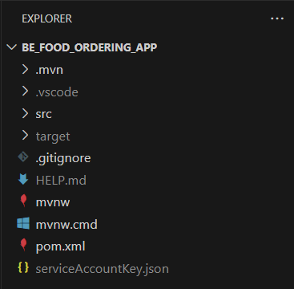
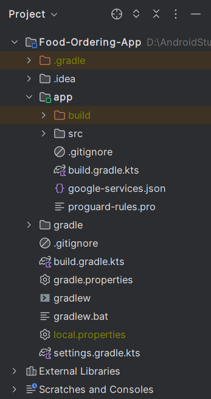
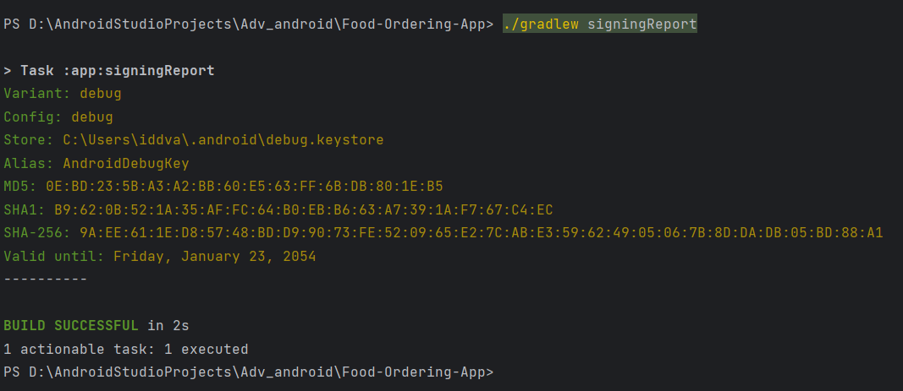

# Java-Food-Ordering-App

## Projects
[Food Ordering App](https://github.com/YangTris/Java-Food-Ordering-App) 

|**Description project**| Food Ordering App: Your go-to solution for efficient order management and seamless food ordering. With its sleek interface and real-time updates, businesses can effortlessly handle orders and track their progress.|
|---------------------|----------------|
| **Technologies used** | Java, APIs (Firebase, Google Maps), Git, VS Code |
| **Team size**         |  3 members |
| **Time start - Time end**         |  Feb 2024 - Apr 2024 |
| **Function**      | • Payment with VnPay  <br> • Rest API <br> • Design appropriate UX/UI based on Material Design Guideline <br> • Working with remote data via REST API and JSON using Retrofit library.|
| **Learning from project** | • Learned how to use Java in conjunction with backend databases and APIs <br> • Working with server side (JSON, REST API) <br> • Integrating third-party libraries (Firebase Notification, Facebook Sdk, Google Maps, ...)  |
| **Github**              |        [](https://github.com/YangTris/Java-Food-Ordering-App)        |

## How to start?

- Clone the Repository

```
git clone https://github.com/YangTris/Java-Food-Ordering-App
```

- Get serviceAccountKey.json

To generate a private key file for your service account:
```
  1. In the Firebase console, open Settings > Service Accounts.

  2. Click Generate New Private Key, then confirm by clicking Generate Key.

  3. Move your config file into the module (app-level) directory of your app.
```


- Get config file for your Android app
```
  1. Go to your the Settings icon Project settings in the Firebase console.

  2. In the Your apps card, select the package name of the app for which you need a config file.

  3. Click  google-services.json.

  4. Move your config file into the module (app-level) directory of your app.
  Make sure that you only have this most recent downloaded config file in your app.
```


- Generate SHA1 and SHA256
```
  1. Go to the root directory of the project from the terminal and run the below command

  2. ./gradlew signingReport

  3. You will get SHA-1, SHA-256, and other details

  4. Add SHA-1 And SHA-256 to firebase
```


- Config IP address
```
  1. Open Command Prompt.
  
  2. Type "ipconfig" > Enter

  3. Search the line Wireless LAN adapter Wi-Fi

  4. IPv4 Address. . . . . . . . . . . : xxx.xxx.xxx.xxx is your Ip address

  5. In Android Studio go to com/example/food_ordering_app/services/ServiceBuilder.java

  6. Replace the String Url by your Ip address
```
 
### That's it. Run your app
